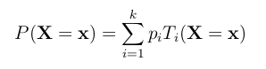
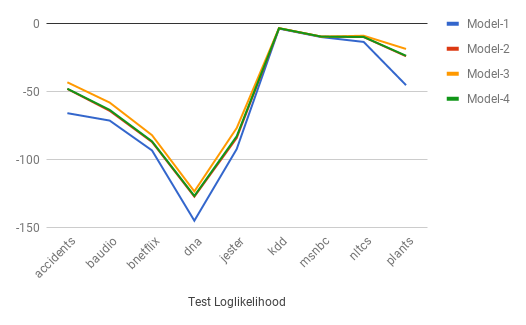
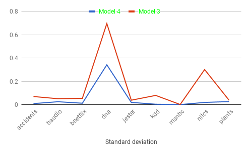

# Learning Bayesian Network

This code was implemented using **java 10.0.1** as part of Homework-4 in CS 6375 Machine Learning at University of Texas at Dallas in Spring 2018 by Harsha Kokel. Four different algorithms were implemented of Learning Bayesian Networks and their performance was tested on 10 datasets. These 10 [datasets](http://www.hlt.utdallas.edu/~vgogate/ml/2018s/homeworks/hw4-datasets.zip) are available on the class web page.

### 1. Independent Bayesian networks.
This algorithm assumes an independent Bayesian Network which has no edges. The parameters are learned using the maximum likelihood approach. 1-Laplace smoothing was used to ensure that there are no zero probabilities in the model. This part is implemented in `IndependentBayesianNetwork.java`. To run this algorithm, modify the `main` method in the file `Test.java` as follows:

```java
public static void main(String[] args) {
		testIndependentBN();
}
```
Refer [usage section](#usage) for details on how to compile and run the code for specific datasets.


### 2. Tree Bayesian networks.
Second method implemented is Structure Learning using [Chow-Liu algorithm](https://www.hlt.utdallas.edu/~vgogate/pgm/sp13/slides/sl.pdf). This assumes that the data has Tree Bayesian Network and the structure and parameters of the Bayesian network are learned. 1-Laplace smoothing is used to ensure that all probabilities are non-zero. This part is implemented in `TreeBayesianNetwork.java`. To run this algorithm, modify the `main` method in the file `Test.java` as follows:

```java
public static void main(String[] args) {
		testTreeBN();
}
```
Refer [usage section](#usage) for details on how to compile and run the code for specific datasets.

### 3. Mixtures of Tree Bayesian networks using EM.
The model is defined as follows. We have one latent variable having ***k***  values and each mixture component is a Tree Bayesian network. Thus, the distribution over the observed variables, denoted by X (variables in the data) is given by:


where ***k*** is the domain size of latent variable, ***p<subscript>i</subscript>*** is the probability of the i-th mixture component and ***T<subscript>i</subscript>*** is the distribution represented by the i-th Tree Bayesian network. EM-algorithm is used to learn the mixture model. In the M-step each mixture component is learned using the Chow-Liu algorithm. The EM algorithm is run until convergence or until 100 iterations whichever is earlier. Value of ***k*** is selected for each dataset by using the validation set. To run this algorithm, modify the `main` method in the file `Test.java` as follows:

```java
public static void main(String[] args) {
	int[] kValues = {2,4,5,7,10,12,15,17,20,25,30,35};
	int numberOfIterations = 10;
	boolean testWithK = true;
	findKofMixtureBN(kValues, numberOfIterations, testWithK);
}
```
The parameters for `findKofMixtureBN` method are explained below,  
**kValues** : *(int[])* array of k values which you want to try  
**numberOfIterations** : *(int)* number of time you want to run the algorithm for each k.  
**testWithK** :  *(boolean)*  false, if you only want to run the training and validation set to find the k. true, if you want to run test set with the best ***k*** found using validation.  
Refer [usage section](#usage) for details on how to compile and run the code for specific datasets.  
If the ***k*** value is known, you can directly run the test by modifying the `main` method as follows:

```java
public static void main(String[] args) {
	int numberOfIterations = 10;
	testMixtureBN(numberOfIterations);
}
```
Refer [usage section](#usage) for details on how to compile and run the code for specifying the ***k*** value for the dataset.

### 4. Mixtures of Tree Bayesian networks using Bagging
The model learns the structure and parameters of the Bayesian Network using the following Bagging-style approach. Generate ***k*** sets of Bootstrap samples and for each set learn the Tree Bayesian network using the Chow-Liu algorithm. Similar to model 3, the distribution over observed variables is given by:


where, ***k*** is the number of bags, ***p<subscript>i</subscript>*** is the probability of the i-th mixture component and ***T<subscript>i</subscript>*** is the distribution represented by the i-th Tree Bayesian network.

Two methods were used to initialize ***p<subscript>i</subscript>***
1. Baseline: ***p<subscript>i</subscript> = 1/k***  
   Here, equal probability of was given to each mixture.
2. Heuristic: ***p<subscript>i</subscript> ~ loglikelihood of training set***  
   Here, mixture which performed better on the loglikelihood of the training set was given higher weightage.

Experiments show that both the methods perform approximately the same. So, I only report the results with the baseline. To run this algorithm, modify the `main` method in the file `Test.java` as follows:

```java
public static void main(String[] args) {
	int[] kValues = {2,5,10,15,20,25,30,35,40,45};
	int numberOfIterations = 10;
	boolean testWithK = true;
	findKofBaggingBN(kValues, numberOfIterations, testWithK);
}
```
The parameters for `findKofMixtureBN` method are explained below,  
**kValues** : *(int[])* array of k values which you want to try  
**numberOfIterations** : *(int)* number of time you want to run the algorithm for each k.  
**testWithK** :  *(boolean)*  false, if you only want to run the training and validation set to find the k. true, if you want to run test set with the best ***k*** found using validation.

Refer [usage section](#usage) for details on how to compile and run the code for specific datasets.

If the ***k*** value is known, you can directly run the test by modifying the `main` method as follows:

```java
public static void main(String[] args) {
	int numberOfIterations = 10;
	testBaggingBN(numberOfIterations);
}
```
Refer [usage section](#usage) for details on how to compile and run the code for specifying the ***k*** value for the dataset.

# Report

The image below shows the log-likelihood obtained for the test sets by the four models on 10 different datasets. Model-1 and Model-2 were run only once as they are deterministic. Model-3 and Model-4 were ran 10 times and the average log likelihood are reported in the table. Model-3 outperforms all the other models for most of the datasets.


#### Test set logLikelihood for all the four models:


| Dataset   |  Model-1 | Model-2 | Model-3 | Model-4 |  
| --------- | -------- | ------- | ------- | ------- |
| accidents | -65.72876882533004 | -47.88032359587462 | -43.02315820381605 | -47.760117755939646 |  
| baudio    | -71.17812237792157 | -64.01945154721751 | -57.942386730244735  | -63.30822559021463 |  
| bnetflix  | -93.14242459241842 | -86.92287771451494 | -81.92602385013016 | -86.43400231870228 |  
| dna       | -144.8262439010813 | -127.13736581858655 | -123.28133639503503 | -126.57372065952923 |  
| jester    | -92.16390258134399 | -84.0076629988646 | -76.68634915468888 | -82.75321433291776 |  
| kdd       | -3.5284530006024375 | -3.310831711199247 | -3.160275601057566  | -3.26588965778046 |  
| msnbc     | -9.767254163763425 | -9.435409303894398 |-9.432363569169166 | -9.431685898962115 |  
| nltcs     | -13.32128520270276 | -9.751239575329642 |-8.772005572463344 | -9.64984801796504 |  
| plants    | -45.10761938833193 | -23.83911455992376 | -18.494230533241172 |-23.495323868802004 |  


## Model 3

The table below reports the average loglikelihood for different ***k*** values for Mixture Tree Bayesian Network.

#### Average Validation set loglikelihood for various K values using Model 3:


| Dataset   |  K=2      | K=4      | K=5      | K=7      | K=10     | K=12     | K=15     | K=17    | K=20    | K=25 | K=30 |K=35|K=45|  
| -------   | --------  | -------- | -------- | -------  | -------  | -------- | ---------| --------| --------|------ |--------|----|----|  
| accidents | -45.9761  | -44.1210 | -43.7253 | -43.3596 | -43.0457 | -42.8920 | -42.6954 |-42.6309 |-42.5371 | ||||  
| baudio    | -60.5300  | -58.8661 | -58.5982 | -58.2411 | -57.9287 | -57.8075 | -57.6779 |-57.6188 | -57.6246 | ||||  
| bnetflix  | -85.4018  | -83.6994 | -83.4252 | -82.8964 | -82.4518 | -82.3129 | -82.0118 |-82.0679 |-81.9340 | -81.8421 | -81.8447|||  
| dna       | -124.2474 |-123.7971 |-122.6303 |-122.9323 |          |          |          |         |        | ||||  
| jester    | -80.0646  | -78.0916 | -77.8095 | -77.4287 | -77.1762 | -77.0768 | -77.0535 |-77.0840 |        |||||  
| kdd       | -3.5362   |-3.5044   | -3.5234  |          |          |          |          |         |        |||||  
| msnbc     | -9.4332   | -9.4326  | -9.4332  |  |   |   |          |          |        |||||  
| nltcs     | -9.3084   | -8.8319  | -8.6875  | -8.6514  | -8.6314  | -8.6233  | -8.6141  | -8.6057 |-8.5994 |-8.5977|-8.5950|-8.5932|||  
| plants    | -22.4688  | -20.9010 | -20.5573 | -20.0870 | -19.5691 | -19.3843 | -19.1873 |-19.0572 |-18.9522|-18.7711 |-18.6954|-18.6351|-18.4887|  

The best ***k*** value obtained in the above table were used for testing. The average loglikelihood obtained on the test set and the standard deviation are reported in the table below.

#### Average Test set loglikelihood for the best K found using validation set:

| Dataset   | K  | average | standard deviation |
| -------   | -- | ----- | ---- |
| accidents | 20 | -43.02315820381605 | 0.07022918452296 |
| baudio    | 17 | -57.942386730244735 | 	0.051457742610838 |
| bnetflix  | 25 | -81.92602385013016|0.054851392050043 |
| dna       | 5 | -123.28133639503503 |  0.69615156552362|
| jester    | 15 | -76.68634915468888 | 0.038729768173449 |
| kdd       | 4  | -3.160275601057566 | 0.07968753909482 |
| msnbc     | 4 | -9.432363569169166 | 0.0018295014151395|
| nltcs     | 35 | -8.772005572463344 |	0.30153215089816 |
| plants    | 45 | -18.494230533241172 |0.038551314867443|


## Model 4

The table below reports the average loglikelihood for different ***k*** values for Bagging Tree Bayesian Network.


#### Average Validation set loglikelihood for various K values:

| Dataset   |  K=2     | K=5      |    K=10  | K=15     | K=20     | K=25     | K=30     | K=35     |
| --------- | -------- | -------- | -------- | -------- | -------- | -------- | -------- | -------- |
| accidents | -47.4221 | -47.3726 | -47.3545 | -47.3646 |||||
| baudio    | -63.3407 | -63.0600 | -62.9284 | -62.8564 | -62.8653 ||||
| bnetflix  | -86.7337 | -86.5793 | -86.5181 | -86.4848 | -86.4786 | -86.4692 | -86.4601 | -86.4612 |
| dna       |-126.9819 |-126.5385 |-126.5386 ||||||
| jester    | -83.7051 | -83.2706 | -83.0843 | -83.0184 | -82.9490 | -82.9296 | -82.9335 ||
| kdd       | -3.6273  | -3.6078  |  -3.6028 |  -3.5987 |  -3.5994 ||||
| msnbc     | -9.4335  | -9.4327  |  -9.4321 |  -9.4322 |||||
| nltcs     | -9.6461  | -9.6194  |  -9.6108 |  -9.6162 |||||
| plants    | -23.6958 | -23.6043 | -23.5397 | -23.5316 | -23.4963 | -23.5149 ||||

The best ***k*** value obtained in the above table were used for testing. The average loglikelihood obtained on the test set and the standard deviation are reported in the table below.

#### Average Test set loglikelihood for the best K found using validation set:

| Dataset   | K  | average | standard deviation |
| -------   | -- | ------------------  | ---- |
| accidents | 10 | -47.760117755939646 | 0.009526357789782 |
| baudio    | 15 | -63.30822559021463| 0.025552648196439 |
| bnetflix  | 30 | -86.43400231870228 | 	0.01280543482531 |
| dna       | 5 | -126.57372065952923 |0.34243628423214 |
| jester    | 25 |  -82.75321433291776 | 0.019927994032406 |
| kdd       | 15 |-3.26588965778046 | 0.004166429855853 |
| msnbc     | 10 | -9.431685898962115 | 0.00089696029712054 |
| nltcs     | 10 | -9.64984801796504 | 0.019723519696117 |
| plants    | 20 | -23.495323868802004 | 0.026811381779713 |

The graph below shows the Standard deviation of logLikelihood values for Model-4 and Model-3. It is evident that bagging helps in reducing the variance.



# Usage

### Configuration changes

To run code for any dataset, you will need to make following changes in the `Test.java` file.

* Update the path of the dataset

```java
	private static final String pathPrefix = "datasets/";
```

* Uncomment the chosen dataset

```java
	static String[][] datasets = {
		{"accidents.test.data","accidents.ts.data", "accidents.valid.data", "20", "10"},
		// {"baudio.test.data", "baudio.ts.data", "baudio.valid.data", "17", "15"},
		// {"bnetflix.test.data","bnetflix.ts.data","bnetflix.valid.data","25", "30"},
		// {"dna.test.data","dna.ts.data","dna.valid.data","5", "5"},
		// {"jester.test.data", "jester.ts.data","jester.valid.data","15", "25"},
		// {"kdd.test.data", "kdd.ts.data","kdd.valid.data","4", "15"},
		// {"msnbc.test.data", "msnbc.ts.data","msnbc.valid.data","4", "10"},
		// {"nltcs.test.data", "nltcs.ts.data", "nltcs.valid.data", "35", "10"},
		// {"plants.test.data", "plants.ts.data", "plants.valid.data","45", "20"},
	};
```

Note that every dataset is an array of String in following order:
Test file, training file, validation file, K for mixture model-3, K for bagging model-4

In case you already know the ***k*** value and want to test the data set, you will have to set the k value in this datasets array.

* Update the `main` method to run the model. Above sections explain how to modify `main` method for each model.

### Compile

This project uses **JraphT** library of java for graph. This dependency is added in the `pom.xml` file and hence maven can be used to compile and run this code.

If you are not familiar with maven, please refer [this](https://maven.apache.org/install.html).

To build the project after making required changes, open terminal and go to the directory which has the `pom.xml`.
command `mvn clean install` will build the project.


### Run

To execute the Test file use `mvn exec:java` command. Make sure your build was successful.
