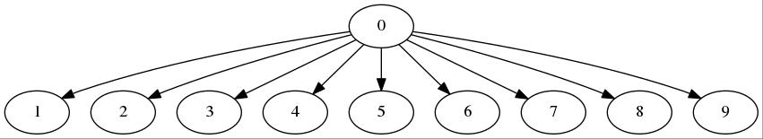
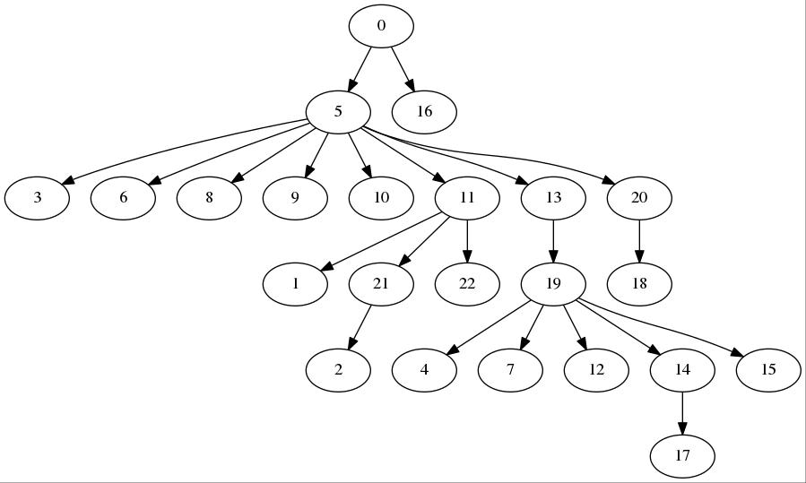

## PS5

This code is implemented by Harsha Kokel as part of Problem set 5 during Spring 2019 for CS 6347 Probablistic Graphical Models, at The University of Texas at Dallas. It is written with python 3.6 aand needs a few libraries like networkx, csgraph, pydot etc for full-functioning.

Code learns two types of Bayesian Network: 1. Naive Bayes 2. Chow Liu Tree for the mushroom data set. Find more details in the ps5.pdf.  

#### Naive Bayes

 Naive Bayes is a simple tree shaped deterministic Bayesian Network, where the root of the tree is the class and all the features are direct child of the root. Similar to the figure shown below.

 

 I use two types of regularization techniques: 1. one-Laplace smoothing and 2. Dirichlet Prior. Turns out that the NB learnt without any regularization is best suited for the given mushroom test data set. Table below compares the performances.  

##### Usage

<!-- Code can be executed either from **command line** or from the **python console**.

##### Command line -->

The code takes 2 mandatory arguments and 1 optional argument

1. `-train` Train file   
2. `-test` Test file  
2. `-reg`  regularization  [default: None, must take value `laplace` or `dirichlet`]


**Sample usage**

```terminal
$ python NB.py -train ./data/mushroom_train.data -test ./data/mushroom_test.data
Correct Prediction:  2640 / 2645
Accuracy:  99.8109640831758
$ python NB.py -train ./data/mushroom_train.data -test ./data/mushroom_test.data
 -reg laplace
Correct Prediction:  2527 / 2645
Accuracy:  95.53875236294896
$ python NB.py -train ./data/mushroom_train.data -test ./data/mushroom_test.data
 -reg dirichlet
Correct Prediction:  2640 / 2645
Accuracy:  99.8109640831758
```
<!--
##### Python console

The code can be imported in python console and can be executed as shown below

**Sample usage**

```console
>>> import NB.NaiveBayes
>>> train_file = './data/mushroom_train.data'
>>> test_file = './data/mushroom_test.data'
>>> nb = NaiveBayes()
>>> nb.train(train_file,False)
>>> nb.test(test_file)
Correct Prediction:  2118 / 2645
Accuracy:  80.07561436672968
>>> regularize_nb = NaiveBayes()
>>> regularize_nb.train(train_file,True)
>>> regularize_nb.test(test_file)
Correct Prediction:  2527 / 2645
Accuracy:  95.53875236294896

``` -->

#### Chow Liu

A discriminative Chow Liu Tree is a tree shaped Bayesian Network with the class variable as its room. Chow-Liu structure learning algorithm calculates the Mutual Information for each pair of nodes and then derives the tree structure using the Maximum Spanning Tree algorithm. The Tree learnt for the give mushroom training data is shown below.   

 

 I use two types of regularization techniques: 1. one-Laplace smoothing and 2. Dirichlet Prior. Turns out that the ChowLiu Bayesian Network learnt performs equally well with both these regularization. Table below compares the performances.  

##### Usage

<!-- Code can be executed either from **command line** or from the **python console**.

##### Command line -->

The code takes 2 mandatory arguments and 2 optional argument

1. `-train` Train file   
2. `-test` Test file  
2. `-reg`  regularization  [default: None, must take value `laplace` or `dirichlet`]
2. `-tree` filename for tree image [must be with jpg extension]

**Sample usage**

```terminal
$ python chow_liu.py -train ./data/mushroom_train.data -test ./data/mushroom_test.data
 -tree chow_liu.jpg
Correct Prediction:  1632 / 2645
Accuracy:  61.70132325141777
$ python chow_liu.py -train ./data/mushroom_train.data -test ./data/mushroom_test.data
 -reg laplace
Correct Prediction:  2605 / 2645
Accuracy:  98.48771266540643
$ python chow_liu.py -train ./data/mushroom_train.data -test ./data/mushroom_test.data
 -reg dirichlet
Correct Prediction:  2605 / 2645
Accuracy:  98.48771266540643
```
<!--
##### Python console

The code can be imported in python console and can be executed as shown below

**Sample usage**

```console
>>> import chow_liu.ChowLiu
>>> train_file = './data/mushroom_train.data'
>>> test_file = './data/mushroom_test.data'
>>> cl = ChowLiu()
>>> cl.train(train_file,False)
>>> cl.test(test_file)
Correct Prediction:  1632 / 2645
Accuracy:  61.70132325141777
>>> regularize_cl = NaiveBayes()
>>> regularize_cl.train(train_file,True)
>>> regularize_cl.test(test_file)
Correct Prediction:  2605 / 2645
Accuracy:  98.48771266540643
```

To see the structure of the chow-liu tree use the write_structure command as shown below.

```console
>>> cl.write_structure('output.jpg')
```
-->

#### Comparision

The table below shows percentage accuracy for different Bayesian Networks with and without regularizations. We see that in general regularizations improve the accuracy but for our current data set for Naive Bayes laplace-smoothing reduces the accuracy.

| Regularization| NB            | Chow Liu  |
| ------------- |:-------------:| -----:|
| None          | 99.8109    | 61.7013 |
| Laplace       |  95.5387      |   98.4877 |
| Dirichlet     | 99.8109      |    98.4877 |
